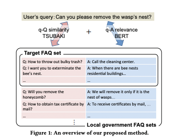
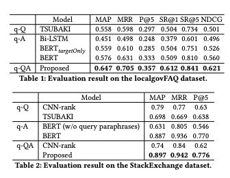

# Papar List

## FAQ Retrieval using Query-Question Similarity and BERT-Based Query-Answer Relevance

### Abstract

+ We propose a FAQ retrieval system that considers the similarity between a user’s query and a question as well as the relevance between the query and an answer
+ Although a common approach to FAQ retrieval is to construct labeled data for training, it takes annotation costs. Therefore, we use a traditional unsupervised information retrieval system to calculate the similarity between the query and question
+ On the other hand, the relevance between the query and answer can be learned by using QA pairs in a FAQ database
+ The recently proposed BERT model is used for the relevance calculation.
+ Since the number of QA pairs in FAQ page is not enough to train a model, we cope with this issue by leveraging FAQ sets that are similar to the one in question
+ We evaluate our approach on two datasets.
  + The first one is localgovFAQ, a dataset we construct in a Japanese administrative municipality domain
  + The second is StackExchange dataset, which is the public dataset in English. We demonstrate that our proposed method outperforms baseline methods on these
    datasets.

### Method

+ q-Q TSUBAKI
+ q-A BERT
+ combine
  + Similarity(Q,q) * t + Relevance(q, A)
  + TSUBAKI’s score tends to be higher when the given query is
    longer. Hence, before taking the sum, we normalize TSUBAKI’s
    score by using the numbers of content words and dependency
    relations in the query
  + We divide the original score by the following
    value:
    + Count(ContentWords) × k1 + Count(DependencyRelations) × k2

### Evaluate 

