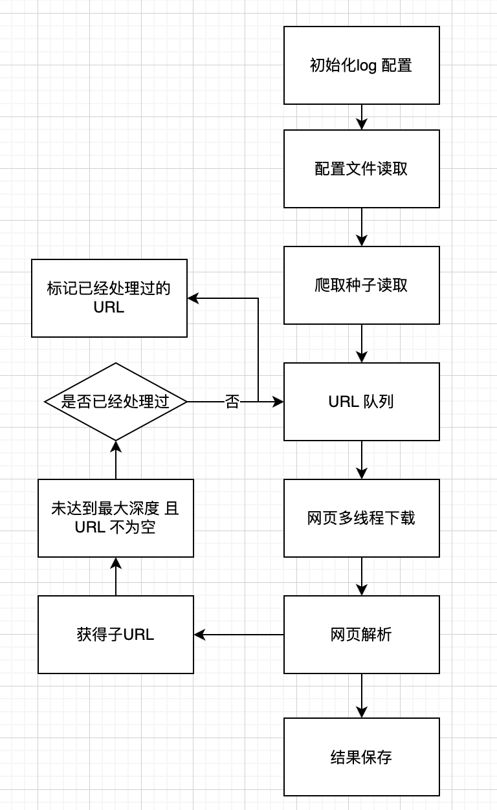

Sunhongchao
===
goodcoder考试

设计思路
---
+ 

代码结构
---
├── CHANGELOG.md
├── README.md
├── ci.yml
├── conf
│   └── spider.conf # 爬虫配置文件
├── config_reader.py # 配置信息读取
├── crawler_thread.py # 爬虫线程处理
├── logger.py # 日志处理
├── logs # 日志保存地址
├── mini_spider.py # 爬虫主程序
├── output # 结果输出地址
├── page_parser.py # 页面解析
├── page_retriever.py # 页面保存
├── requirements.txt # 环境依赖
├── seedfile_reader.py # 种子文件读取
├── setup.cfg 
├── setup.py 
├── tests # 单元测试
│   ├── __init__.py
│   ├── test_config_reader.py
│   ├── test_crawler.py
│   ├── test_page_parser.py
│   ├── test_page_retriever.py
│   └── test_seed_file_reader.py
└── urls # 种子文件
    └── seeds.txt

快速开始
---
构建安装
+ python 3.6
+ pip install -r requirements.txt

运行
+ python mini_spider.py -c conf/spider.conf
  + 描述 : mini_spider.py 为项目的主程序，通过-c 参数读取 spider.conf

测试
---
如何执行自动化测试

见 tests中的各个UT

如何贡献
---
贡献patch流程及质量要求

版本信息
---
本项目的各版本信息和变更历史可以在[这里][changelog]查看。

维护者
---
### owners
* sunhongchao(sunhongchao@baidu.com)

### committers
* sunhongchao(sunhongchao@baidu.com)

讨论
---
百度Hi交流群：群号

[changelog]: http://icode.baidu.com/repos/baidu/goodcoder/sunhongchao/blob/master:CHANGELOG.md
